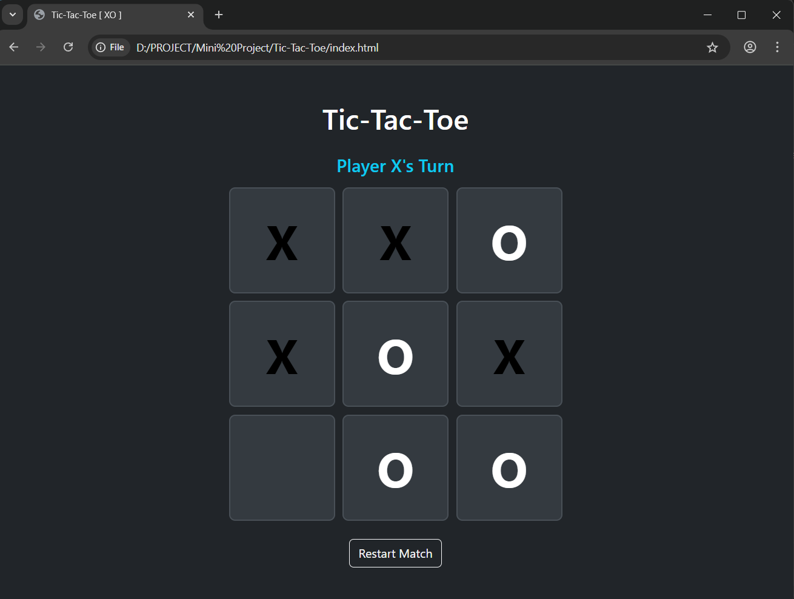

❌⭕ Tic-Tac-Toe Web Game

A simple two-player Tic-Tac-Toe web game built using HTML, CSS, Bootstrap, and JavaScript. The game includes player turn logic, match draw detection, and allows players to choose their own colors for a better playing experience.

🚀 Features
Two-player gameplay
Player turn indication
Win and draw detection
Player color selection
Responsive design using Bootstrap
Clean and user-friendly UI

🛠️ Tech Stack
HTML5 – Structure
CSS3 – Styling
Bootstrap – Responsive layout
JavaScript – Game logic and interactions

📂 Project Purpose
This project is created for learning and practice purposes to improve JavaScript logic, DOM manipulation, and interactive UI development.

📸 Preview

📌 How to Play
Clone the repository
Open index.html in a web browser
Choose player colors
Take turns to play and enjoy the game
